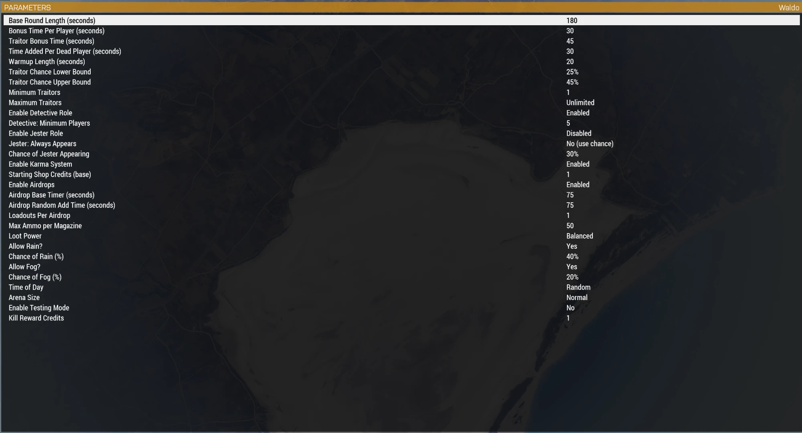

# Lobby Parameters

All lobby parameters are read by index in `Waldo_fnc_loadParams`, matching the order they're declared in `description.ext`'s `class Params`. If you're editing that file, appending a new parameter after the existing ones keeps every other index stable; inserting one in the middle shifts everything after it and will silently break the read.

## Round

| Parameter | What it controls |
|---|---|
| Base Round Length | The civilian clock's starting point, before any bonuses. |
| Bonus Time Per Player | Added per player to the base length. |
| Traitor Bonus Time | Added on top of the civilian clock to get the hard deadline (`timelimit`). |
| Time Added Per Dead Player | Extends `timelimit` by this much on every death. |
| Warmup Length | Seconds spent on the "Selecting Roles" screen before the round goes live. Can be skipped early from the dev menu. |

## Roles

| Parameter | What it controls |
|---|---|
| Traitor Chance Lower/Upper Bound | The range `assignRoles` rolls a random Traitor percentage from. |
| Minimum/Maximum Traitors | Hard clamps on the rolled count. Max 0 means unlimited. If Max is set below Min, Min wins. |
| Enable Detective Role | Off entirely disables the role. |
| Detective: Minimum Players | Lobby size floor before a Detective is assigned at all. |
| Enable Jester Role | Off entirely disables the role. |
| Jester: Minimum Players | Lobby size floor before a Jester is assigned at all (default 10). |
| Jester: Always Appears | Skips the chance roll and guarantees a Jester, once the minimum-players floor is met. |
| Chance of Jester Appearing | The roll used when "Always Appears" is off. |

## Gameplay

| Parameter | What it controls |
|---|---|
| Enable Karma System | Toggles the cross-round RDM penalty (see [Architecture](Dev-Architecture)). |
| Starting Shop Credits (base) | Traitor/Detective starting credits, before the per-player scaling below. |
| Additional Starting Credit per N Players | Traitor/Detective starting credits also get +1 for every N players in the lobby (default 8). |

## Airdrop / loot

| Parameter | What it controls |
|---|---|
| Enable Airdrops | Off stops the round loop from ever calling `spawnAirdrop`. |
| Airdrop Base/Random Timer | The wait between drops is base + a random roll up to this many extra seconds. |
| Loadouts Per Airdrop | How many weapon loadouts a non-golden crate gets. |
| Max Ammo per Magazine | Ground loot won't include a magazine holding more than this. |
| Loot Power | Low (SMGs/pistols only), Balanced (low-powered, topped up with standard rifles if sparse), or Anything (low and standard mixed unconditionally). |

## Environment

| Parameter | What it controls |
|---|---|
| Allow Rain? / Chance of Rain | Whether `setupWeather` can roll rain, and how likely. |
| Allow Fog? / Chance of Fog | Same, for fog. |
| Time of Day | Random, Dawn, Day, Dusk, or Night. Each non-random option rolls within that window rather than a fixed hour. |

## Arena

| Parameter | What it controls |
|---|---|
| Arena Size | Small / Normal / Large, a 0.75x / 1x / 1.5x multiplier on the radius `selectArena` computes from player count. |

## Testing

| Parameter | What it controls |
|---|---|
| Enable Testing Mode | Unlocks the dev/test menu (`\`) and the instant role-cycle key (`]`). See [Dev and Test Mode](Dev-Test-Mode). Off, none of that exists for a normal game. |

## A server difficulty setting, not a lobby parameter, that hosts must change

**Kill Messages** needs to be off in your server's difficulty settings, and this isn't something any parameter above (or `description.ext`) can do for you. Every player slot is `side="Civilian"`, so a Traitor killing an Innocent, a Detective, or anyone else looks to the engine like plain civilian-on-civilian same-side fire. With Kill Messages enabled, Arma broadcasts the killer's and victim's names to everyone's system chat the moment it happens - which names the Traitor in plain text and ends the round's mystery instantly. Set it before you host, not after someone dies mid-round and asks what that chat line meant.

## A fixed lobby bug worth knowing about

Every boolean-style parameter here reads as a numeric `{0,1}` value compared with `!= 0`, not as a `{False,True}` value with a bool default. Arma silently ignores a bool-typed lobby parameter that has a bool default, it just always returns the default no matter what the host picked in the lobby. An earlier version of this mission used bool defaults on several of these (Jester and Testing Mode included), which meant turning them on from the lobby did nothing. If you're adding a new on/off parameter, follow the existing pattern rather than the more "obvious" bool one.
