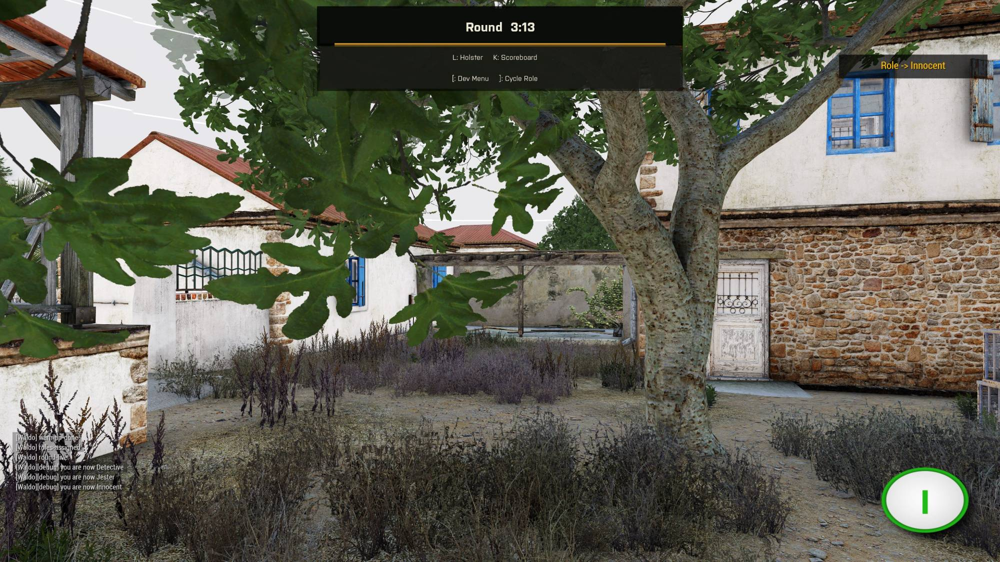
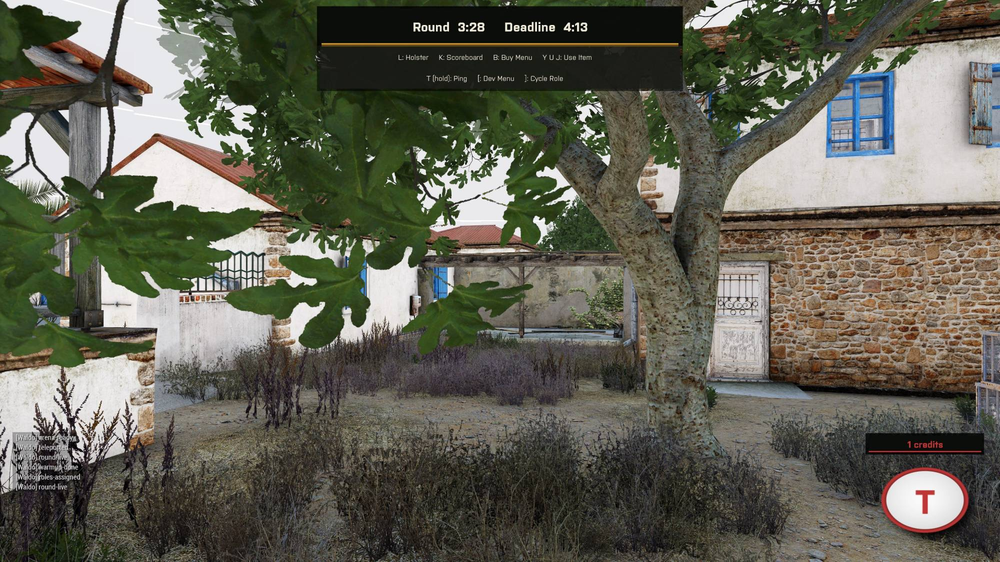
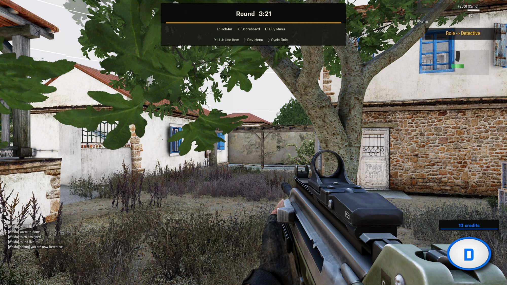
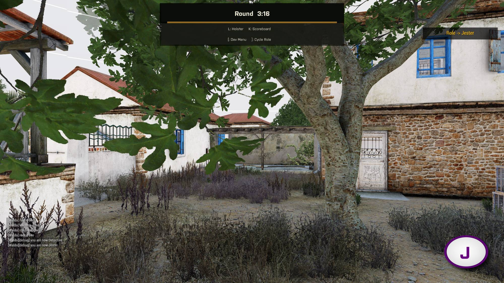

# Roles and Win Conditions

## The four roles

**Innocent.** The majority. No powers, no information beyond what they can deduce. Wins when every Traitor is dead.

**Traitor.** A hidden minority who know each other's identities from the start. They share a credit shop with sabotage and counter-investigation tools, and win by killing everyone who isn't a Traitor.

**Detective.** A publicly known Innocent (everyone can see who the Detective is) with their own investigation-focused shop: testing, DNA scanning, radar. Wins alongside the Innocents.

**Jester.** Deals no damage (a `Fired` event handler deletes their own projectiles) and cannot win the normal way. Traitors are told who the Jester is. If a non-Traitor kills them, the Jester wins instead and nobody else does; being killed by a Traitor accomplishes nothing for the Jester - and costs the Traitor who did it a kill-reward's worth of credits, since it doesn't advance the Traitors' own win condition either.

Role assignment (`Waldo_fnc_assignRoles`) resets every player to Innocent, then picks Traitors from a shuffled pool sized by the lobby's Traitor chance range (clamped by Min/Max Traitors), then a Detective if the lobby size clears `DetectiveMinPlayers`, then a Jester if enabled and either "Always Appears" or a chance roll succeeds.

## How a round ends

`Waldo_fnc_checkWin` runs once a second and evaluates endings in a fixed priority order, because more than one condition can technically be true in the same tick:

1. **END4, Jester wins** - a non-Traitor cleanly killed the Jester this round (`JESTERCLEANKILL`). Checked first so a Jester's win can never be preempted by a same-tick Traitor wipe.
2. **END1, Innocents win** - a Traitor side existed this round and none of them are alive.
3. **END2, Traitors win** - a Traitor side existed, a non-Traitor side existed, and none of the non-Traitors are alive. A living Jester counts as a non-Traitor for this check, so a lone surviving Jester blocks the Traitors from winning until they're dealt with.
4. **END3, time's up** - the round timer reached its limit with nobody having won outright. This is scored as an Innocents survival, not a loss for anyone.

Both team endings require a Traitor side to have existed at all (`count _traitors > 0`), and END2 additionally requires that a non-Traitor side existed (`Waldo_hadNonTraitors`, set in `assignRoles`). Without that second guard, a lobby that happened to assign every player as a Traitor would win instantly the moment the round loop ticked, which is a real degenerate case in a very small lobby.

## Round timing

The civilian clock and the hard deadline are two different numbers:

- `Waldo_startTime` = base round length + (player count x bonus-per-player). This is what players see counting down.
- `timelimit` = `Waldo_startTime` + the Traitor bonus. This is the actual hard cutoff (`checkWin`'s END3 check).

Every death extends `timelimit` by the "time added per dead player" setting, so a round with a lot of killing runs longer than a quiet one, on the theory that more bodies means more to investigate.
