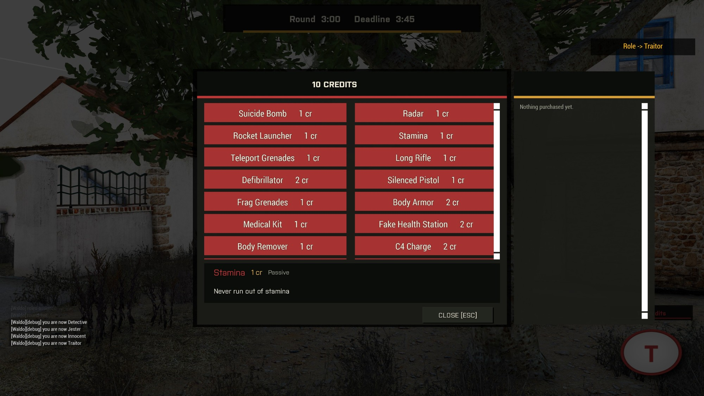
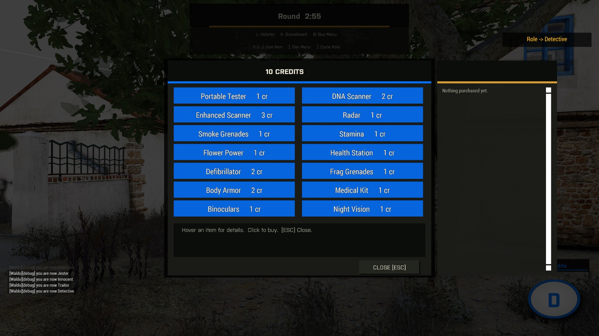

# Shops and Items

Traitors and Detectives each get a shop (press **B**) with roughly fourteen items, built at runtime from a data-driven catalog in `Waldo_fnc_initShops`. Adding an item is a single array entry, no dialog or UI edits:

```
[ _name, _cost, _type, _onBuy, _onActivate, _tooltip ]
```

- `_type` is `"passive"`, `"weapon"`, or `"activation"`.
- `_onBuy` runs immediately when the item is purchased.
- `_onActivate` (activation items only) runs when the player presses whichever of **Y** / **U** / **J** the item is bound to. It returns `true` to consume the item or `false` to leave it assigned, which is how items like the DNA scanner or tester stay available if you pressed the key without a valid target in front of you.

Activation items get 3 key slots (Y/U/J), not one - the first activation item you buy lands on Y, the second on U, the third on J. Buy a fourth and it goes to a backlog instead of bumping anything, until you free up a slot (by using one) or reassign one yourself from the shop's Purchased panel, where every owned, not-yet-used activation item shows a Y/U/J button row - click one to move that item to that key.

## Traitor shop

Suicide Bomb, Radar (pulses everyone's position, recharges), Rocket Launcher, Stamina, Teleport Grenades (red smoke that warps you to where it lands), Long Rifle, Defibrillator (revives a body onto the Traitor team), Silenced Pistol, Frag Grenades, Body Armor, Body Remover (destroys a corpse outright, denying the Detective evidence), C4 Charge, Night Vision, Dead Ringer, False Flag, Disguiser (copy a living player's exact loadout for 60 seconds - see [Investigation Mechanics](Player-Investigation-Mechanics) for how it also redirects your DNA).



## Detective shop

Portable Tester (reveals a role at close range), DNA Scanner, Enhanced Scanner (upgrades the DNA Scanner), Radar, Smoke Grenades, Stamina, Flower Power (a novelty round-turns-into-flowers effect), Health Station, Defibrillator (revives a body as whatever it was), Frag Grenades, Body Armor, Medical Kit, Binoculars, Night Vision.



Weapon and gear classnames in both catalogs are read from `missionNamespace` at click time (`TraitorRifle`, `ShopArmorVest`, `ShopFrag`, and so on), which is what makes the shop follow whatever mods the dynamic arsenal discovered rather than hardcoding classnames. See [Equipment System](Dev-Equipment-System).

## The Purchased panel

A second panel in the shop dialog lists everything bought this round with its tooltip as a how-to-use reminder (`Waldo_purchases`, reset each round in `assignRoles`), newest purchase at the top - buying something new pushes everything already there down beneath it. The point is that you're never three purchases deep and unable to remember what an item you bought five minutes ago actually does.

For activation items specifically, each entry also shows which key (Y/U/J) it's currently bound to - or `[unassigned]` if it's sitting in the backlog because all 3 slots were already taken when you bought it, or `[used]` once it's been spent. Click any of the Y/U/J buttons on that row to (re)assign it to that key; whatever was already there gets bumped to the backlog rather than lost.

## Revive, in more detail

Both shops' defibrillators call `Waldo_fnc_revive`, which is more involved than it looks because Arma has no real "undo death." A truly dead unit (`damage` 1, the `Killed` event already fired) can never be revived in place, respawn always creates a brand-new unit object. So the revive flow forces an early respawn (`setPlayerRespawnTime 0`) and stashes the revive intent (which role to become) on the corpse. The mission-root `onPlayerRespawn.sqf` hook then re-homes everything onto the actual new unit the moment it exists: role and shop credits, the round's kill count, the Purchased log, the per-life kill/damage event handlers that were bound to the old unit object, a basic loadout, and an HUD refresh. `Waldo_fnc_reviveRelink` (server-side) handles repointing `TraitorList`/`DetectiveList`/`JesterList` off the dead reference, since a forced Traitor conversion needs that list to be correct for win checks and credit awards.
